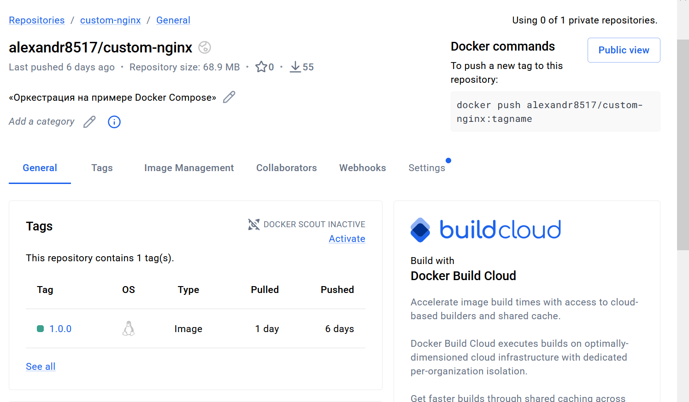
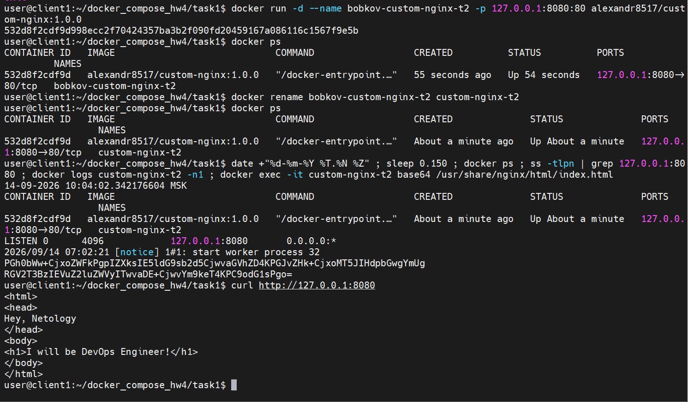
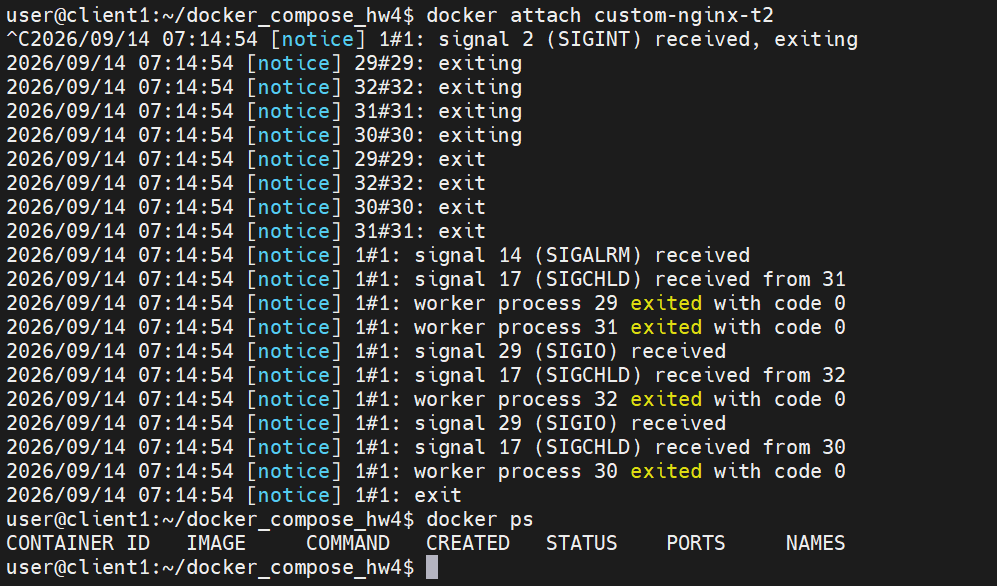
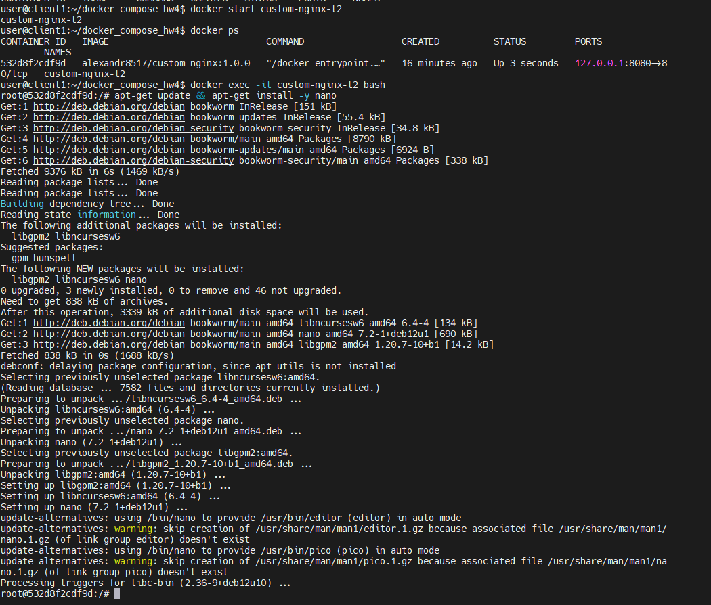
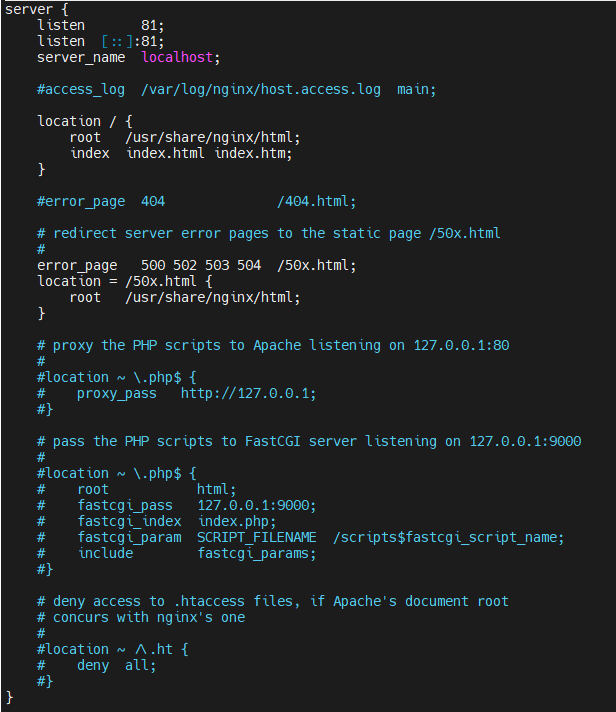
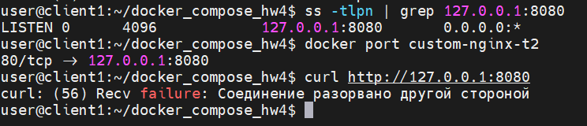
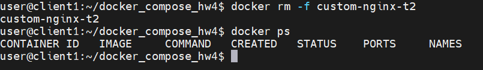
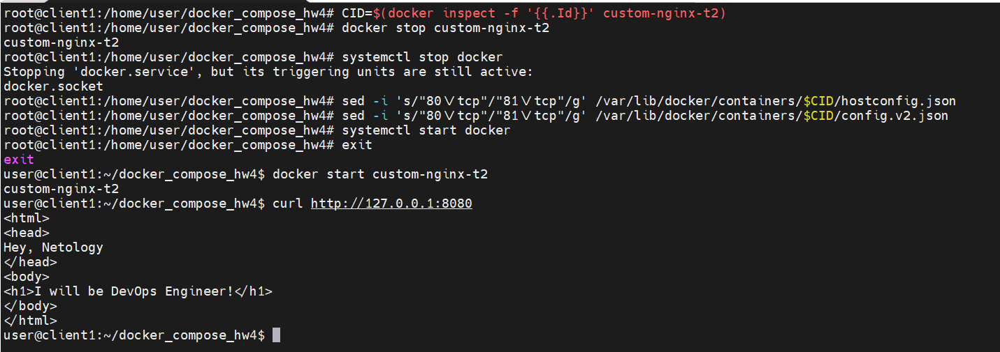
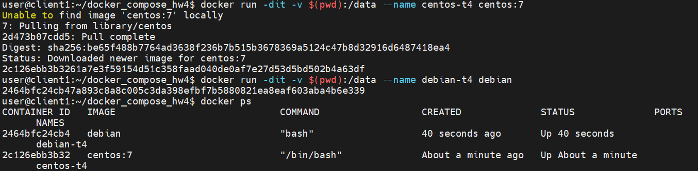
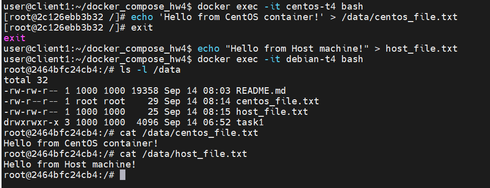

<details>
<summary><b>Задание</b></summary>
# Домашнее задание к занятию 4 «Оркестрация группой Docker контейнеров на примере Docker Compose»

### Инструкция к выполению

1. Для выполнения заданий обязательно ознакомьтесь с [инструкцией](https://github.com/netology-code/devops-materials/blob/master/cloudwork.MD) по экономии облачных ресурсов. Это нужно, чтобы не расходовать средства, полученные в результате использования промокода.
2. Практические задачи выполняйте на личной рабочей станции или созданной вами ранее ВМ в облаке.
3. Своё решение к задачам оформите в вашем GitHub репозитории в формате markdown!!!
4. В личном кабинете отправьте на проверку ссылку на .md-файл в вашем репозитории.

## Задача 1

Сценарий выполнения задачи:
- Установите docker и docker compose plugin на свою linux рабочую станцию или ВМ.
- Если dockerhub недоступен создайте файл /etc/docker/daemon.json с содержимым: ```{"registry-mirrors": ["https://mirror.gcr.io", "https://daocloud.io", "https://c.163.com/", "https://registry.docker-cn.com"]}```
- Зарегистрируйтесь и создайте публичный репозиторий  с именем "custom-nginx" на https://hub.docker.com (ТОЛЬКО ЕСЛИ У ВАС ЕСТЬ ДОСТУП);
- скачайте образ nginx:1.29.0;
- Создайте Dockerfile и реализуйте в нем замену дефолтной индекс-страницы(/usr/share/nginx/html/index.html), на файл index.html с содержимым:
```
<html>
<head>
Hey, Netology
</head>
<body>
<h1>I will be DevOps Engineer!</h1>
</body>
</html>
```
- Соберите и отправьте созданный образ в свой dockerhub-репозитории c tag 1.0.0 (ТОЛЬКО ЕСЛИ ЕСТЬ ДОСТУП). 
- Предоставьте ответ в виде ссылки на https://hub.docker.com/<username_repo>/custom-nginx/general .

## Задача 2
1. Запустите ваш образ custom-nginx:1.0.0 командой docker run в соответвии с требованиями:
- имя контейнера "ФИО-custom-nginx-t2"
- контейнер работает в фоне
- контейнер опубликован на порту хост системы 127.0.0.1:8080
2. Не удаляя, переименуйте контейнер в "custom-nginx-t2"
3. Выполните команду ```date +"%d-%m-%Y %T.%N %Z" ; sleep 0.150 ; docker ps ; ss -tlpn | grep 127.0.0.1:8080  ; docker logs custom-nginx-t2 -n1 ; docker exec -it custom-nginx-t2 base64 /usr/share/nginx/html/index.html```
4. Убедитесь с помощью curl или веб браузера, что индекс-страница доступна.

В качестве ответа приложите скриншоты консоли, где видно все введенные команды и их вывод.


## Задача 3
1. Воспользуйтесь docker help или google, чтобы узнать как подключиться к стандартному потоку ввода/вывода/ошибок контейнера "custom-nginx-t2".
2. Подключитесь к контейнеру и нажмите комбинацию Ctrl-C.
3. Выполните ```docker ps -a``` и объясните своими словами почему контейнер остановился.
4. Перезапустите контейнер
5. Зайдите в интерактивный терминал контейнера "custom-nginx-t2" с оболочкой bash.
6. Установите любимый текстовый редактор(vim, nano итд) с помощью apt-get.
7. Отредактируйте файл "/etc/nginx/conf.d/default.conf", заменив порт "listen 80" на "listen 81".
8. Запомните(!) и выполните команду ```nginx -s reload```, а затем внутри контейнера ```curl http://127.0.0.1:80 ; curl http://127.0.0.1:81```.
9. Выйдите из контейнера, набрав в консоли  ```exit``` или Ctrl-D.
10. Проверьте вывод команд: ```ss -tlpn | grep 127.0.0.1:8080``` , ```docker port custom-nginx-t2```, ```curl http://127.0.0.1:8080```. Кратко объясните суть возникшей проблемы.
11. * Это дополнительное, необязательное задание. Попробуйте самостоятельно исправить конфигурацию контейнера, используя доступные источники в интернете. Не изменяйте конфигурацию nginx и не удаляйте контейнер. Останавливать контейнер можно. [пример источника](https://www.baeldung.com/linux/assign-port-docker-container)
12. Удалите запущенный контейнер "custom-nginx-t2", не останавливая его.(воспользуйтесь --help или google)

В качестве ответа приложите скриншоты консоли, где видно все введенные команды и их вывод.

## Задача 4


- Запустите первый контейнер из образа ***centos*** c любым тегом в фоновом режиме, подключив папку  текущий рабочий каталог ```$(pwd)``` на хостовой машине в ```/data``` контейнера, используя ключ -v.
- Запустите второй контейнер из образа ***debian*** в фоновом режиме, подключив текущий рабочий каталог ```$(pwd)``` в ```/data``` контейнера. 
- Подключитесь к первому контейнеру с помощью ```docker exec``` и создайте текстовый файл любого содержания в ```/data```.
- Добавьте ещё один файл в текущий каталог ```$(pwd)``` на хостовой машине.
- Подключитесь во второй контейнер и отобразите листинг и содержание файлов в ```/data``` контейнера.


В качестве ответа приложите скриншоты консоли, где видно все введенные команды и их вывод.


## Задача 5

1. Создайте отдельную директорию(например /tmp/netology/docker/task5) и 2 файла внутри него.
"compose.yaml" с содержимым:
```
version: "3"
services:
  portainer:
    network_mode: host
    image: portainer/portainer-ce:latest
    volumes:
      - /var/run/docker.sock:/var/run/docker.sock
```
"docker-compose.yaml" с содержимым:
```
version: "3"
services:
  registry:
    image: registry:2

    ports:
    - "5000:5000"
```

И выполните команду "docker compose up -d". Какой из файлов был запущен и почему? (подсказка: https://docs.docker.com/compose/compose-application-model/#the-compose-file )

2. Отредактируйте файл compose.yaml так, чтобы были запущенны оба файла. (подсказка: https://docs.docker.com/compose/compose-file/14-include/)

3. Выполните в консоли вашей хостовой ОС необходимые команды чтобы залить образ custom-nginx как custom-nginx:latest в запущенное вами, локальное registry. Дополнительная документация: https://distribution.github.io/distribution/about/deploying/
4. Откройте страницу "https://127.0.0.1:9000" и произведите начальную настройку portainer.(логин и пароль адмнистратора)
5. Откройте страницу "http://127.0.0.1:9000/#!/home", выберите ваше local  окружение. Перейдите на вкладку "stacks" и в "web editor" задеплойте следующий компоуз:

```
version: '3'

services:
  nginx:
    image: 127.0.0.1:5000/custom-nginx
    ports:
      - "9090:80"
```
6. Перейдите на страницу "http://127.0.0.1:9000/#!/2/docker/containers", выберите контейнер с nginx и нажмите на кнопку "inspect". В представлении <> Tree разверните поле "Config" и сделайте скриншот от поля "AppArmorProfile" до "Driver".

7. Удалите любой из манифестов компоуза(например compose.yaml).  Выполните команду "docker compose up -d". Прочитайте warning, объясните суть предупреждения и выполните предложенное действие. Погасите compose-проект ОДНОЙ(обязательно!!) командой.

В качестве ответа приложите скриншоты консоли, где видно все введенные команды и их вывод, файл compose.yaml , скриншот portainer c задеплоенным компоузом.

---

### Правила приема

Домашнее задание выполните в файле readme.md в GitHub-репозитории. В личном кабинете отправьте на проверку ссылку на .md-файл в вашем репозитории.

</details>
-----
-----


<details>
<summary><b>Ответ Задача 1</b></summary>
**0. Скачивание базового образа**
Сначала скачиваем официальный образ веб-сервера нужной версии на локальную машину:
* **`docker pull`** — команда для загрузки образов из Docker Hub без их запуска.
```bash
docker pull nginx:1.29.0
```


**1. Подготовка рабочей директории и создание файлов**

```bash
mkdir task1 && cd task1

cat << 'EOF' > index.html
<html>
<head>
Hey, Netology
</head>
<body>
<h1>I will be DevOps Engineer!</h1>
</body>
</html>
EOF

cat << 'EOF' > Dockerfile
FROM nginx:1.29.0
COPY index.html /usr/share/nginx/html/index.html
EOF
```

**2. Сборка и публикация образа**
* **`docker build`** — команда сборки образа. 
* Флаг **`-t` (tag)** задает имя и версию (тег) образа. 
* **`.` (точка)** указывает Докеру искать `Dockerfile` в текущей директории.
* **`docker push`** — загружает собранный образ с локального компьютера в публичный реестр Docker Hub.

```bash
docker build -t alexandr8517/custom-nginx:1.0.0 .
docker push alexandr8517/custom-nginx:1.0.0
```

**Ссылка на Docker Hub:**
[https://hub.docker.com/repository/docker/alexandr8517/custom-nginx/general](https://hub.docker.com/repository/docker/alexandr8517/custom-nginx/general)
> 📸 ** Скриншот c hub.docker.com:** 📸
> 


</details>

-----
-----
<details>
<summary><b>Ответ Задача 2</b></summary>
**Выполненные команды:**
* Флаг **`-d` (detach)** запускает контейнер в фоновом режиме (освобождая консоль).
* Флаг **`--name`** задает контейнеру удобное имя вместо случайного набора букв.
* Флаг **`-p 127.0.0.1:8080:80`** пробрасывает порт (порт хоста : порт контейнера). Трафик с порта 8080 ПК пойдет на 80-й порт внутри контейнера.
* **`curl`** — утилита для проверки доступности сайтов (делает HTTP-запрос).

```bash
# Запуск контейнера
docker run -d --name bobkov-custom-nginx-t2 -p 127.0.0.1:8080:80 alexandr8517/custom-nginx:1.0.0

# Переименование контейнера
docker rename bobkov-custom-nginx-t2 custom-nginx-t2

# Скрипт проверки из задания
date +"%d-%m-%Y %T.%N %Z" ; sleep 0.150 ; docker ps ; ss -tlpn | grep 127.0.0.1:8080 ; docker logs custom-nginx-t2 -n1 ; docker exec -it custom-nginx-t2 base64 /usr/share/nginx/html/index.html

# Проверка доступности веб-страницы снаружи
curl [http://127.0.0.1:8080](http://127.0.0.1:8080)
```

> 📸 ** Скриншот команд:** 📸
> 

</details>

-----
-----

<details>
<summary><b>Ответ Задача 3</b></summary>
**1. Объяснение остановки контейнера после нажатия Ctrl-C:**

> 📸 ** Скриншот команд:** 📸
> 

Команда `docker attach custom-nginx-t2` подключает терминал к потокам ввода-вывода (stdout/stderr) главного процесса контейнера (Nginx, PID 1). Нажатие `Ctrl+C` отправляет процессу сигнал прерывания `SIGINT`. Так как главный процесс завершает работу, Docker автоматически останавливает весь контейнер — его жизненный цикл жестко привязан к процессу с PID 1.


**2. Редактирование конфигурации и проверка:**
* **`docker exec`** — позволяет выполнить команду внутри уже работающего контейнера.
* Флаги **`-it`** открывают интерактивный терминал, а `bash` запускает командную оболочку.

```bash
docker start custom-nginx-t2
docker exec -it custom-nginx-t2 bash
apt-get update && apt-get install -y nano
nano /etc/nginx/conf.d/default.conf # изменено с listen 80 на listen 81
nginx -s reload # перезагрузка конфигурации веб-сервера без остановки процесса
curl [http://127.0.0.1:80](http://127.0.0.1:80) # отказ
curl [http://127.0.0.1:81](http://127.0.0.1:81) # успех
exit
```
> 📸 ** Скриншот команд:** 📸
> 

> 📸 ** Скриншот редактирования порта в nano внутри контейнера:** 📸
> 


**3. Объяснение сути проблемы при проверке снаружи:**
> 📸 ** Скриншот команд:** 📸
> 

`ss -tlpn | grep 127.0.0.1:8080` показал, что моя хостовая виртуальная машина всё еще слушает порт 8080.

`docker port custom-nginx-t2` показал, что правило маршрутизации никуда не делось: Docker всё еще направляет весь трафик с порта 8080 хоста на внутренний порт 80 контейнера.

`curl http://127.0.0.1:8080` выдал ошибку Recv failure: Соединение разорвано другой стороной.
Запрос от curl успешно дошел до порта 8080, Docker послушно прокинул его на 80-й порт внутрь контейнера... но там никого нет! Наш Nginx теперь сидит на 81-м порту. Поэтому операционная система внутри контейнера сбрасывает соединение ("разорвано другой стороной").

При выполнении `curl http://127.0.0.1:8080` на хосте возникает ошибка. 
**Суть проблемы:** При создании контейнера мы жестко привязали порт хоста 8080 к внутреннему порту 80. Изменив конфиг Nginx внутри на `listen 81`, мы заставили веб-сервер слушать 81-й порт. Трафик с хоста всё еще перенаправляется в контейнер на 80-й порт, но там его больше никто не принимает.


**4. Удаление контейнера без остановки:**
* Флаг **`-f` (force)** принудительно удаляет контейнер, даже если он работает.
```bash
docker rm -f custom-nginx-t2
```
> 📸 ** Скриншот удаление контейнера:** 📸
> 

**5. (Дополнительное задание) Исправление конфигурации контейнера без его удаления:**

* Поскольку контейнер был удален пересоздадим его и вернем к некоректному состоянию
```bash
docker run -d --name custom-nginx-t2 -p 127.0.0.1:8080:80 alexandr8517/custom-nginx:1.0.0
docker exec -it custom-nginx-t2 bash -c "apt-get update && apt-get install -y nano && sed -i 's/80;/81;/g' /etc/nginx/conf.d/default.conf && nginx -s reload"
```

### 1. Узнаем полный ID нашего контейнера и сохраняем его в переменную CID
``` CID=$(docker inspect -f '{{.Id}}' custom-nginx-t2) ```

### 2. Останавливаем контейнер
``` docker stop custom-nginx-t2 ```

### 3. Останавливаем сам Docker (иначе он перезапишет настройки своими)
``` sudo systemctl stop docker ```

### 4. Меняем порт 80 на 81 в системном файле hostconfig.json (с помощью утилиты sed)
``` sudo sed -i 's/"80\/tcp"/"81\/tcp"/g' /var/lib/docker/containers/$CID/hostconfig.json ```

### 5. Меняем порт 80 на 81 в системном файле config.v2.json
``` sudo sed -i 's/"80\/tcp"/"81\/tcp"/g' /var/lib/docker/containers/$CID/config.v2.json ```

### 6. Запускаем Docker обратно
``` sudo systemctl start docker ```

### 7. Запускаем  контейнер
``` docker start custom-nginx-t2 ```

### 8. Проверяем.
``` curl http://127.0.0.1:8080 ```

> 📸 ** Скриншот выполненных команд и проверка доступности:** 📸
> 


</details>

-----
-----

<details>
<summary><b>Ответ Задача 4</b></summary>

**Выполненные команды :**
* Флаг **`-v` (volume)** монтирует папку хоста внутрь контейнера.
* Переменная **`$(pwd)`** автоматически подставляет полный путь к текущей папке.

```bash
# Запуск контейнеров с монтированием текущей директории в /data
docker run -dit -v $(pwd):/data --name centos-t4 centos:7
docker run -dit -v $(pwd):/data --name debian-t4 debian

> 📸 ** Скриншот запущенных контейнеров:** 📸
> 

# Создание файла внутри CentOS
docker exec -it centos-t4 bash
echo 'Hello from CentOS container!' > /data/centos_file.txt
exit

# Создание файла на хост-машине
echo "Hello from Host machine!" > host_file.txt

# Проверка файлов внутри Debian (ls -l выводит список, cat читает содержимое)
docker exec -it debian-t4 bash
ls -l /data
cat /data/centos_file.txt
cat /data/host_file.txt
exit
```

> 📸 ** Скриншот выполненных команд и результат:** 📸
> 

</details>

-----
-----

<details>
<summary><b>Ответ Задача 5</b></summary>

</details>

